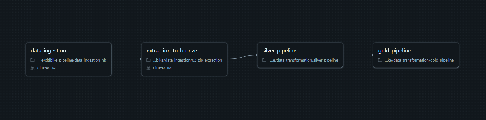

#CITI-BIKE TRIPDATA PIPELINE

##Summary
---
This pipeline is designed to ingest, transform, and standardize all publicly available Citi Bike trip data.
>Data source: https://s3.amazonaws.com/tripdata/index.html

You can select specific years or even download all available data.
The **silver_pipeline** normalizes and stores the data in your cloud environment.
The **gold_pipeline** then processes this standardized data to produce insights.

The entire solution was built and tested on **Databricks** platform.

Job structure:

 